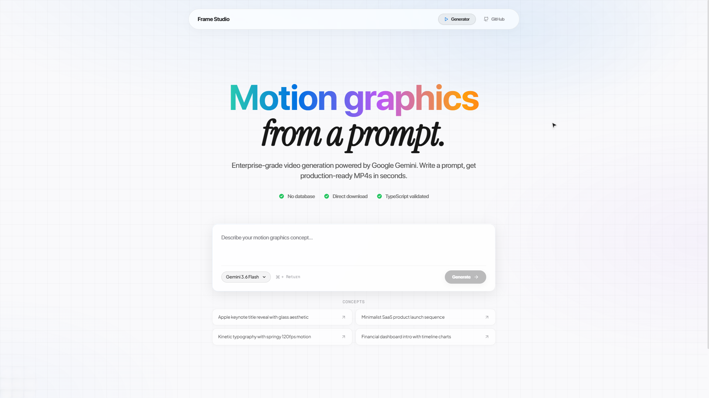

# Frame Studio



AI motion graphics generator using React, Remotion, TypeScript, and Google Gemini API.

Provide a text prompt and API key. Frame Studio generates a Remotion video project, compiles it, renders an MP4, and streams it to your browser for download.

## Architecture

Client provides API key via browser modal (stored in HTTP-only cookie). Single API endpoint runs the full pipeline: plan → codegen → compile → fix → render → stream MP4.

**Pipeline:**
1. Plan: Gemini creates video structure from prompt
2. Codegen: Gemini writes React/Remotion code
3. Compile: TypeScript validation in sandbox
4. Fix: Gemini repairs compilation errors (max 3 attempts)
5. Render: Remotion renders MP4
6. Stream: Direct download to browser

**Tech:**
- Next.js 15 (webpack)
- Remotion 4.0 for rendering
- Google Gemini API for code generation
- No database, no storage, no background workers

## Project Structure

```
apps/web/           Next.js app with API routes and UI
packages/pipeline/  AI processing (prompts, schemas, LLM client)
packages/remotion-skeleton/  Template for video projects
workers/render-worker/  Compile and render functions
```

## Setup

Install dependencies:
```bash
pnpm install
```

Optional: Create `.env` for server-side API key fallback:
```bash
cp .env.example .env
```

Add Gemini API key:
```env
GEMINI_API_KEY=AIzaSy...
```

If not set, users provide their own key via browser modal.

## Running

```bash
pnpm dev
```

Application runs at `http://localhost:3000`.

## Gemini API Key

Get a key from [Google AI Studio](https://aistudio.google.com/api-keys).

## Features

- Custom animated cursor (macOS-style arrow with hover states)
- Animated gradient heading
- Model selector (6 Gemini models)
- Real-time progress screen with stage updates
- Typing animation with motion blur effect
- Premium glassmorphic UI

## Notes

- Uses webpack (not Turbopack) for stability
- API key stored in HTTP-only cookies
- Videos render at 1920x1080, 30fps
- Supports 25+ Google Fonts for premium typography

## License

MIT

